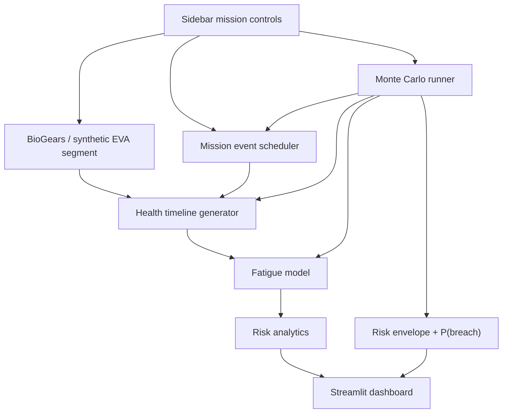

# AstroGuard

Astronaut health digital twin for EVA mission-risk simulation using physiology modelling, fatigue dynamics, and Monte Carlo uncertainty analysis.

## Why This Project Matters

Spacewalks create coupled physiological risk: exertion raises heart rate and core temperature, suit constraints affect recovery, dehydration can drift cardiovascular load upward, and fatigue can accumulate across a mission timeline. AstroGuard turns those interactions into an inspectable dashboard for exploring mission safety decisions.

This project is valuable as an early research prototype because it connects:

- physics-based physiology simulation through BioGears when available
- synthetic fallback models for reproducible demos
- stochastic event scheduling across 24-72 hour missions
- minute-level health timelines
- fatigue accumulation and recovery equations
- Monte Carlo risk envelopes and breach probability

## Features

| Module | Capability |
|---|---|
| BioGears adapter | Runs or emulates a short EVA physiology segment. |
| Mission events | Schedules EVA, sleep/recovery, and dehydration episodes. |
| Health timeline | Builds HR, SpO2, core temperature, respiration, and fatigue signals. |
| Fatigue model | Estimates accumulated fatigue from exertion and recovery states. |
| Risk analytics | Computes peak fatigue, time-at-risk, risk windows, and end trend. |
| Monte Carlo | Simulates uncertain mission variants and estimates P(breach). |
| Dashboard | Streamlit interface with charts, controls, and mission status. |

## System Architecture



## Tech Stack

| Area | Tools |
|---|---|
| Application | Python, Streamlit |
| Data | Pandas, NumPy |
| Analytics | SciPy, Monte Carlo simulation |
| Visualization | Plotly / Streamlit charts |
| Physiology | BioGears adapter with synthetic fallback |
| Persistence | CSV mission logs, precomputed XML segments |

## Installation

```bash
python -m venv .venv
. .venv/bin/activate
pip install -r requirements.txt
```

If BioGears is installed, configure the adapter path in `simulation/biogears.py`. If it is not installed, AstroGuard falls back to a synthetic physiology segment so the dashboard still runs.

## Usage

```bash
streamlit run app.py
```

Open `http://localhost:8501`, choose mission duration, EVA intensity, risk threshold, and Monte Carlo sample count, then execute the simulation.

## Demo

Add these assets:

```text
docs/demo/dashboard-overview.png
docs/demo/monte-carlo-risk-envelope.gif
docs/demo/phase-space-fatigue.png
```

Suggested demo story:

1. Run a safe moderate-intensity EVA.
2. Increase EVA intensity and duration.
3. Show fatigue crossing the threshold.
4. Run Monte Carlo and explain P(breach).
5. Compare BioGears-derived and synthetic fatigue signals.

## Folder Structure

```text
AstroGuard/
├── app.py                         # Streamlit dashboard
├── fatigue_model.py               # Standalone/model exploration
├── analytics/
│   └── risk.py                    # Risk windows, trend, Monte Carlo summaries
├── simulation/
│   ├── biogears.py                # BioGears adapter + fallback generation
│   ├── events.py                  # EVA/sleep/dehydration scheduling
│   ├── fatigue.py                 # Fatigue accumulation model
│   ├── health_vars.py             # Physiological timeline generation
│   ├── mission_log.py             # Mission log persistence
│   └── patient.py                 # Patient/astronaut profile
├── visualization/
│   └── charts.py                  # Dashboard chart construction
├── precomputed/                   # Cached physiology segments
├── mission_logs/                  # Generated XML logs
└── README.md
```

## Risk Model Summary

| Signal | Interpretation |
|---|---|
| Heart rate | Primary exertion proxy used by fatigue dynamics. |
| SpO2 | Oxygenation risk indicator. |
| Core temperature | Thermal load and overheating proxy. |
| Fatigue index | 0-1 mission-risk signal with threshold-based status. |
| P(breach) | Fraction of Monte Carlo runs where fatigue exceeds threshold. |

Mission status:

```text
SAFE     peak fatigue comfortably below threshold
MONITOR  peak fatigue approaches threshold or uncertainty rises
ABORT    fatigue crosses threshold with sustained or rising risk
```

## Challenges Faced

- Bridging short physiology-engine output into longer mission timelines without pretending the model is a clinical predictor.
- Keeping synthetic fallback behavior plausible enough for demos while labeling it clearly.
- Presenting Monte Carlo uncertainty in a way that supports decisions rather than just showing more charts.
- Maintaining clean package boundaries between simulation, analytics, and visualization.

## Research / Engineering Insights

- A digital twin prototype is most credible when assumptions are visible.
- Monte Carlo output is more useful than a single "risk score" because mission timing uncertainty matters.
- Physiological signals become more interpretable when event windows are overlaid directly on the timeline.

## Future Improvements

- Add validation notes comparing BioGears output against published EVA physiology ranges.
- Add unit tests for fatigue equations, event scheduling, and risk-window extraction.
- Add scenario export/import for reproducible mission comparisons.
- Add crew profiles with configurable baseline HR, max HR, hydration sensitivity, and recovery rate.
- Add a real-time telemetry ingestion path for wearable or simulated sensor streams.

## Troubleshooting

| Symptom | Likely Cause | Fix |
|---|---|---|
| BioGears not found | Engine path not configured | Use synthetic fallback or set the correct executable path. |
| Dashboard is slow | Monte Carlo sample count too high | Start with 50-100 runs, then increase. |
| Empty charts | Simulation returned no timeline | Check mission duration and event configuration. |
| Encoding artifacts in README | Windows terminal decoded UTF-8 incorrectly | Keep README in UTF-8 and prefer ASCII diagrams. |

## License

Recommended: MIT for an open research prototype, unless BioGears integration imposes additional distribution constraints.
